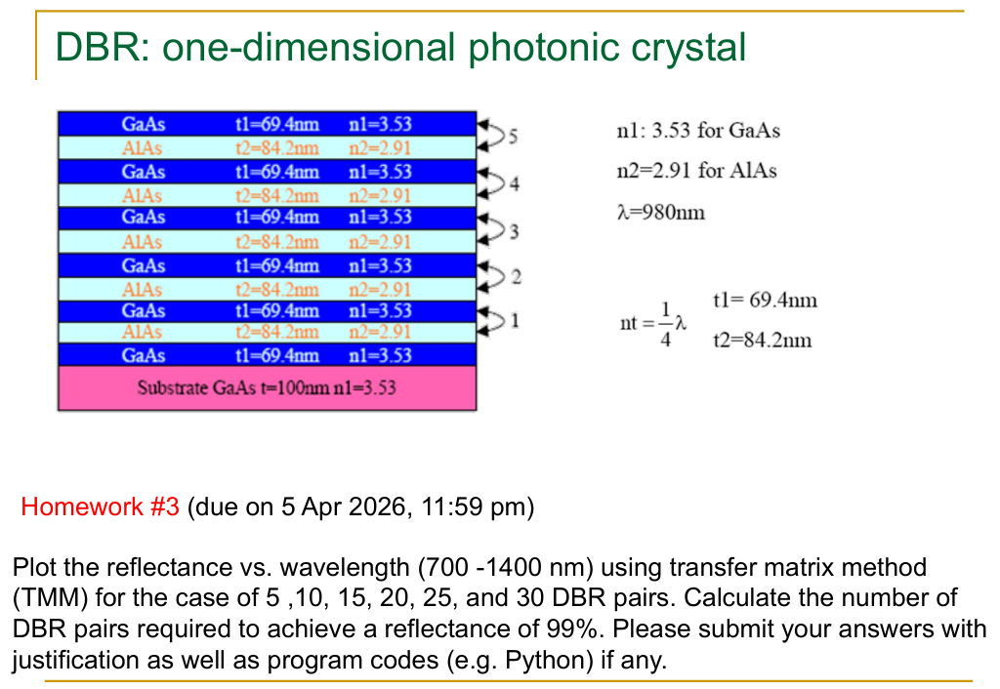

# Assignment 3

  

This assignment expects outside/online help, such as LLMs. However, there exists an [online Github repository](https://github.com/PuspenduPH/1D-Photonic-Crystals-Spectra-Analysis-TMM) that serves as an amazing resource to learn more about TMM and reflectance as well as generate plots.
  * To my knowledge, the code provided is free to use as long as you include copyright and permission notice.
  * Again, detailed knowledge of TMM and reflectance are not tested in finals (after asking Prof. Yang).
